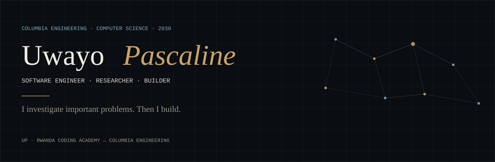
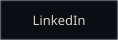
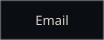
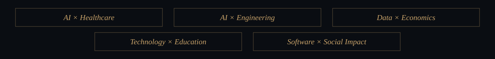
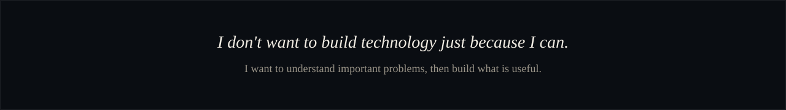

  

  
  &nbsp;
  
  &nbsp;
  
  &nbsp;
  

<em>Curious student → Researcher → Builder → Columbia Engineering</em>

Computer Science at **Columbia Engineering**. Economics as a minor.  
Software and embedded systems from **Rwanda Coding Academy**.

I work where a real problem becomes a computing problem — in health, agriculture, education, finance, and intelligent systems.

### Now

Studying Computer Science at Columbia. Learning to investigate before I build. Interested in AI, software engineering, data, embedded systems, and technology that is actually useful to people.

### Experience

**[RCA MIS](https://portfolio-uwayo.vercel.app/experience)** — DevOps Engineer, Rwanda Coding Academy. *November 2024 – May 2026.* Kept a school-wide academic and admin platform secure, reliable, and able to scale.

**[SACOLA](https://portfolio-uwayo.vercel.app/experience)** — Full-Stack Developer Intern. *Summer 2025.*

**[New Health Intelligence Center](https://portfolio-uwayo.vercel.app/experience)** — Software / Technology Contributor. *September 2025 – August 2026.*

### Selected work

**[SurVie](https://portfolio-uwayo.vercel.app/projects/survie)** — Health / AI. A more connected medical-information ecosystem. *Concept.*

**[Stratiq](https://portfolio-uwayo.vercel.app/projects/stratiq)** — Data / finance. AI as a lens on financial decisions. *Exploration.*

**[OpenLab](https://portfolio-uwayo.vercel.app/projects/openlab)** — Education. Virtual STEM labs where physical labs are scarce. *Exploration.*

**[Sarura](https://portfolio-uwayo.vercel.app/projects/sarura)** — AgriTech. Farm and household decisions in one place. *Exploration.*

**[Platy AI](https://portfolio-uwayo.vercel.app/projects/platy-ai)** — Nutrition. Better grocery decisions within a budget. *Exploration.*

Robotics and the rest live on the [portfolio](https://portfolio-uwayo.vercel.app/projects).

### Student research

Work at Rwanda Coding Academy, including three papers with **Dr. Awet Fesseha**.

1. **[Morphing aircraft wings](https://portfolio-uwayo.vercel.app/research/adaptive-morphing-aircraft-wings)** — NEMS, AI, and aerodynamics as an optimization problem.
2. **[Mobile money and poverty traps](https://portfolio-uwayo.vercel.app/research/data-science-and-poverty-traps)** — whether digital finance can signal vulnerability in East Africa.
3. **[Bias in health data](https://portfolio-uwayo.vercel.app/research/algorithmic-bias-in-health-datasets)** — fairness for underrepresented populations in Rwanda's health system.

Student research. Investigation, not deployed products.

 

  
    <a href="https://portfolio-uwayo.vercel.app">portfolio-uwayo.vercel.app</a>
    ·
    <a href="https://github.com/upascalin3">github.com/upascalin3</a>
    ·
    She/Her
  

<!--
  This file belongs at the root of github.com/upascalin3/upascalin3
  together with the assets/ folder. That special repository is what GitHub
  shows as the profile README.
-->
