

  

  
  &nbsp;
  
  &nbsp;
  
  &nbsp;
  

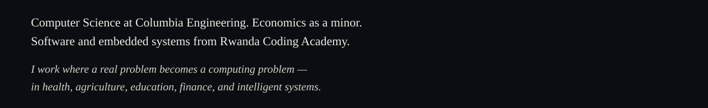

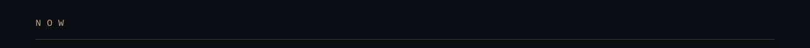
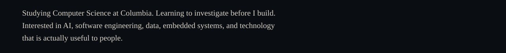

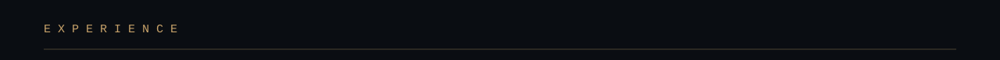
<a href="https://portfolio-uwayo.vercel.app/experience">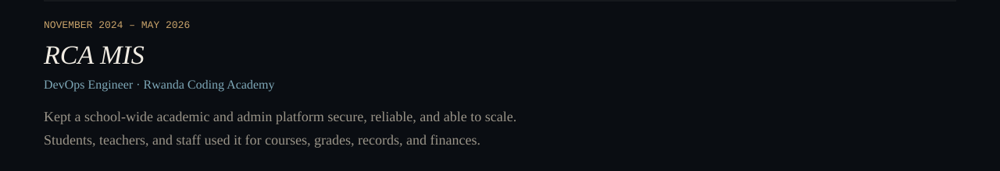</a>
<a href="https://portfolio-uwayo.vercel.app/experience">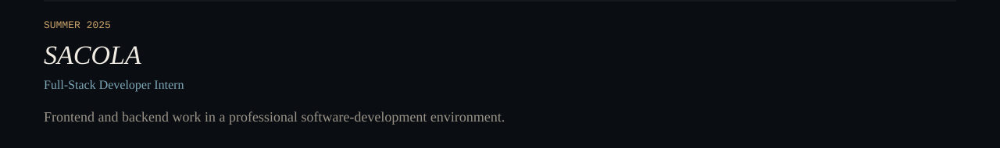</a>
<a href="https://portfolio-uwayo.vercel.app/experience">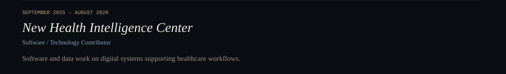</a>

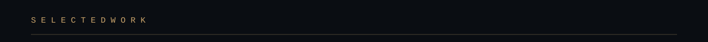
<a href="https://portfolio-uwayo.vercel.app/projects/survie">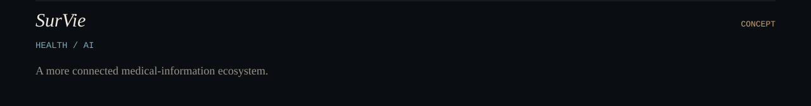</a>
<a href="https://portfolio-uwayo.vercel.app/projects/stratiq">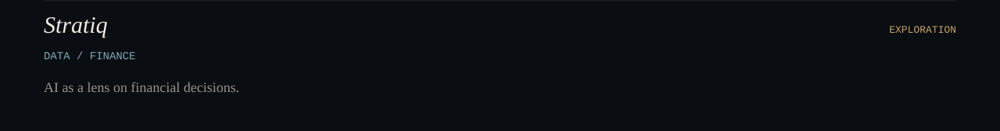</a>
<a href="https://portfolio-uwayo.vercel.app/projects/openlab">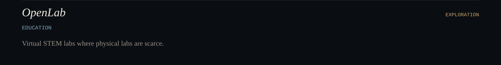</a>
<a href="https://portfolio-uwayo.vercel.app/projects/sarura">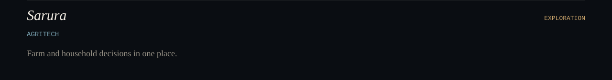</a>
<a href="https://portfolio-uwayo.vercel.app/projects/platy-ai">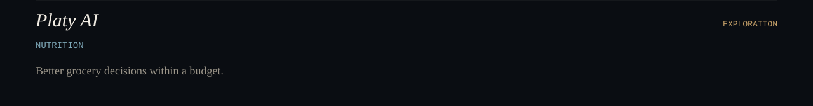</a>

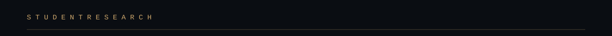
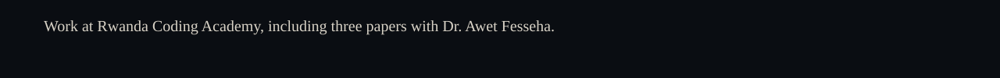
<a href="https://portfolio-uwayo.vercel.app/research/adaptive-morphing-aircraft-wings">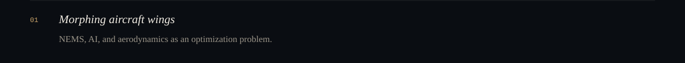</a>
<a href="https://portfolio-uwayo.vercel.app/research/data-science-and-poverty-traps">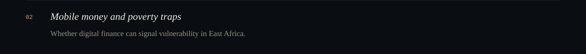</a>
<a href="https://portfolio-uwayo.vercel.app/research/algorithmic-bias-in-health-datasets">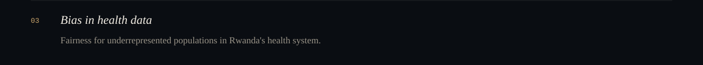</a>

  

<!--
  This file belongs at the root of github.com/upascalin3/upascalin3
  together with the assets/ folder.
-->
